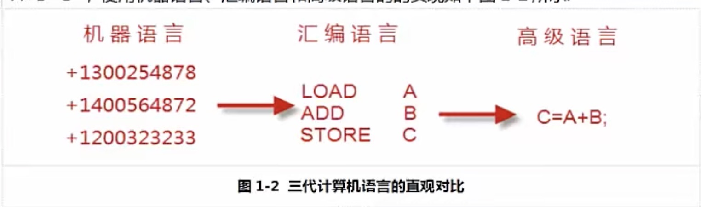

#Java_onte
####计算机语言发展以及未来方向

- 计算机语言已经成为人大脑的延伸
  1. 计算机已经成为我们这个时代的核心设备,每时每刻都需要它，计算机也不再是大家以前想想的台式机,服务器,
  已经演变成我们身边随处可见的物体,比如:手机，平板电脑,笔记本，以及很多人没有意识到的，但是实际上设备内部包含计算机, 的
  设备，比如电视机,微波炉,甚至小孩子玩的玩具等等
  2. 可以这么说计算机,已经成为人类延伸的一部分,大脑的延伸,成为不可以或缺的一部分,未来计算机将真的进入人体,成为大脑的一部分。
- 计算机语言发展历史:
    1. 机器语言:相当于人类的初始阶段.
        1. 是由数字组成的指令,当你使用数字编程的,写几百个数字,甚至几千个数字,是很痛苦的.
        机器语言是由数字组成(最终被简化成0和1),对于人类来说,机器语言过于繁琐,使用机器语言,人类无法编写出复杂的程序.
    2. 汇编语言:相当于人类工业阶段
        1. 为了编程方便,以及解决更加复杂的问题,程序开始改进机器语言,使用英文缩写的助记符来表示基本的计算机操作,这一些助记符,
        构成了汇编语言的基础,汇编语言相当于人类的手工工业社会,
        2. 汇编语言虽然可以编写高效率的程序,但是学习和调试都不是很容易,并且很难调试,另外一个复杂的问题,汇编语言以及早期的计算机语言没有考虑
        结构化设计原则,而是使用goto语句来作为程序流程控制的主要方法,这样做的后果是:一大堆混乱的跳转语句使得程序几乎不可能被读懂,
        对于程序员来说,对懂别人或者自己编写的代码也是一种挑战
        3. 汇编语言,仍然应用在工业电子编程,软件加密解密，计算机病毒分析等等
    3. 高级语言:相当于人类进入工业革命阶段
        1. 对于简单的任务,汇编语言可以胜任,但是随着计算机的发展,渗透到啦工作生活中,一些复杂的任务出现啦,汇编语言就显得力不从心啦,于是出现啦高级语言,
        比如C,C++,Java等都是高级语言.
        2. 高级语言允许程序员使用接近日常英语的指令来编写程序,例如实现一个简单的任务,A+B=C,
        每种语言实现如下
        3. 
    4. 高级语言的出现,尤其是面向对象的出现,相当于人类的现代社会,高级语言及其简单,编程门槛和难度大大降低,
    大量的人员进入到软件行业,为软件的爆发性提供了充足的人力资源.
- 常见编程语言介绍:
    1. C语言:诞生于1972年,是编程语言的鼻祖,由著名的贝尔实验室发明,C语言追求结构化,模块化,高效率的"编程语言之花",在底层编程中,比如嵌入式,病毒开发等应用,
    可以替代汇编语言来开发系统程序,在高层应用也可以开放操作系统(linux,unix,windows)都基于C语言开发,以及各种应用软件
    2. C++语言,作为C语言的扩展,是由贝尔实验室在80年推出的,C++是一种混合的语言,既可以实现面向对象编程也可以实现面向过程编程.
    C++ 主要在科学计算,操作系统,网络通讯,系统开发引擎开发中被大量使用.
    3. Java语言:在1995年发明的,目前业界应用范围最广,使用人数最多的语言,
    Java语言主要用在企业级软件开发,安卓移动开发,大数据云计算开发中,设计IT中很多的方面
    4. JavaScript语言: JavaScript是一门脚本语言,已经广泛被用于Web应用开发,应用范围很广,重要性越来越高,目前比较流行的H5开发的核心,其实就是JavaScript语言.
    5. Python语言:在1989年发明,语法简单,易学易懂,Python具有丰富的库,它常被成为胶水语言,能够把其他的语言制作的各种模块很轻松的联结在一起,Python应用广泛:图形处理，
    科学计算,web编程,多媒体应用,引擎开发,尤其在未来机器学习和人工智能有非常大的潜力.
    6. PHP语言:一般用于Web领域开发,大量中小型网站,以及某一些大型网站使用PHP开发.
    7. Object-c和Swift语言:Object-c是C语言衍生出来的,继承了C语言的特点,是扩充了C的面向对象,主要用于苹果软件的开发,SWift语言:是在2014年,推出的基于mac平台开发的新语言,
    用来搭建基于苹果平台的应用程序
    8. C#语言:C#是微软公司发布的一种面向对象的语言,运行在.NET Framework之上的高级程序设计语言,C#是基于windows操作系统的应用开发,这一领域在取代C++,占据主导地位,
    9. Go语言:是由Google开发的一种静态语言,编译型语言,Go语言语法和C相似,但功能上有内存安全,GC结构形态等等
    10. 易语言:是一门中文编程的语言
- Java语言介绍:
    1.  
 
  
    
        
        
        