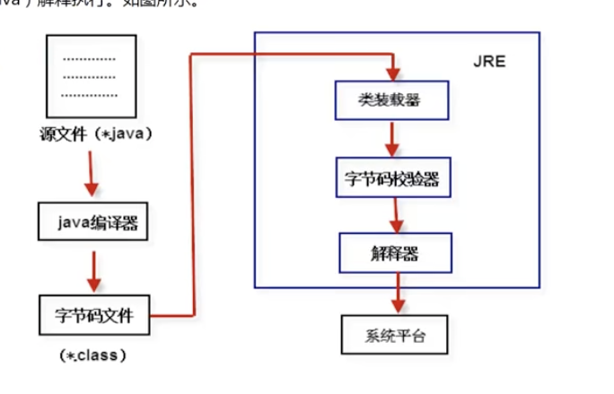
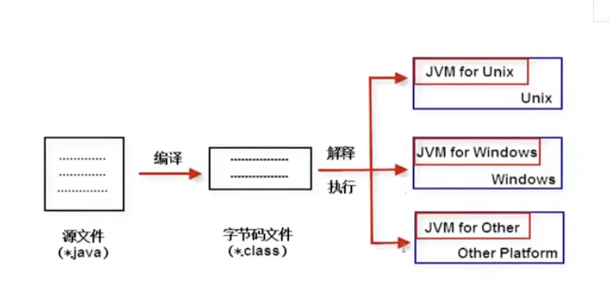
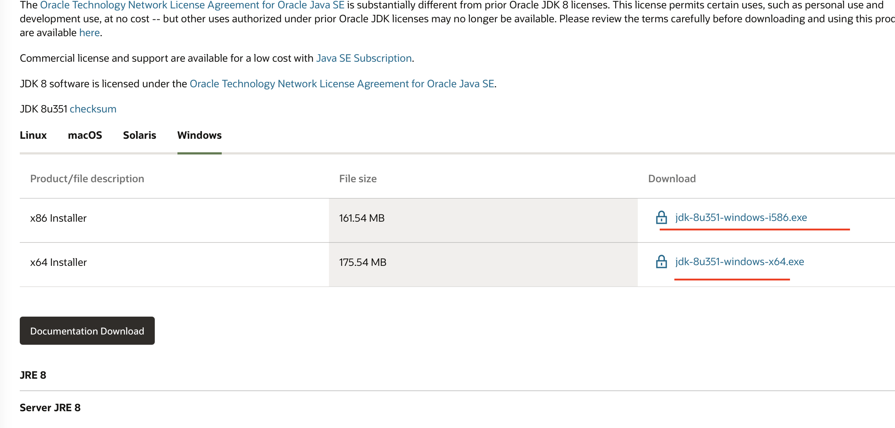
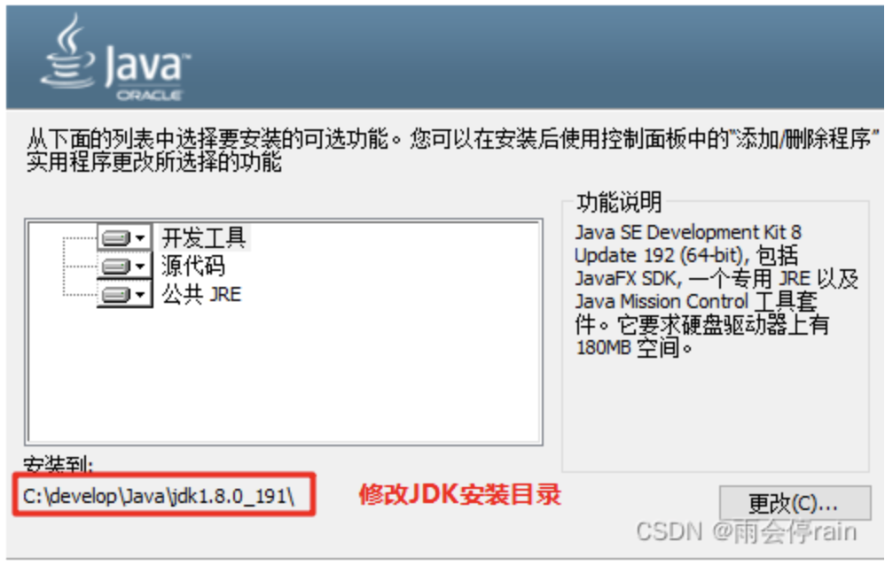
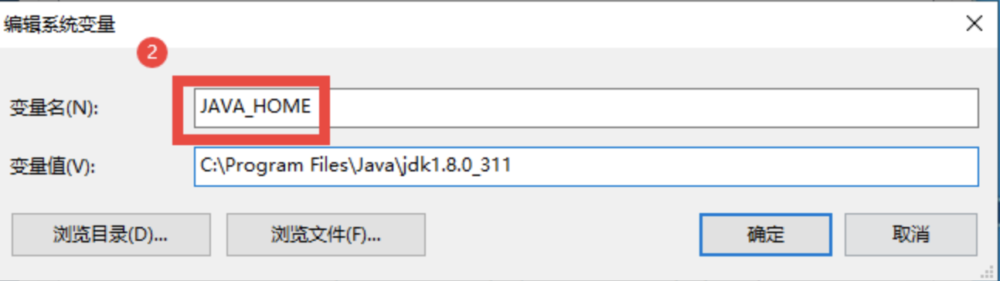
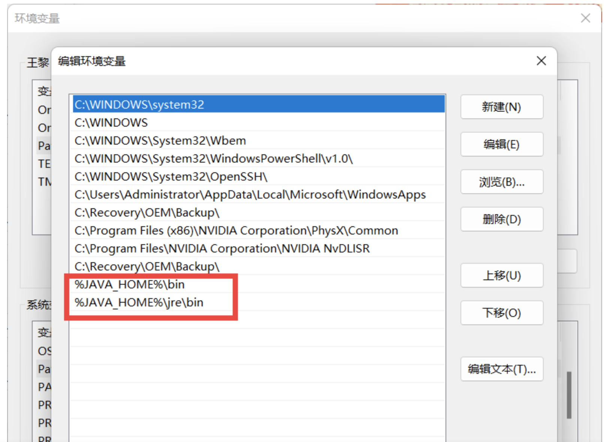
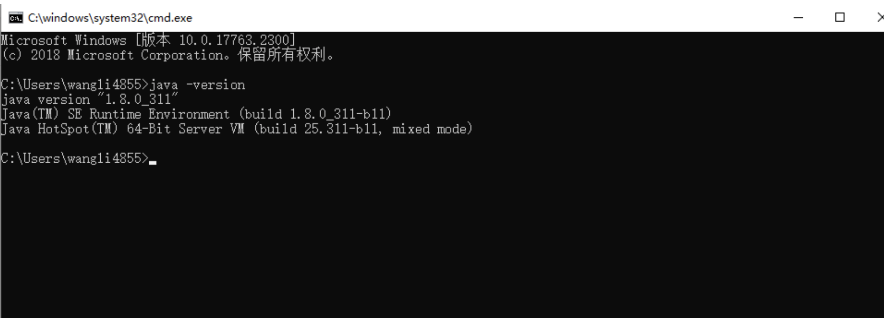

#Java_onte
####计算机语言发展以及未来方向

- 计算机语言已经成为人大脑的延伸
  1. 计算机已经成为我们这个时代的核心设备,每时每刻都需要它，计算机也不再是大家以前想想的台式机,服务器,
  已经演变成我们身边随处可见的物体,比如:手机，平板电脑,笔记本，以及很多人没有意识到的，但是实际上设备内部包含计算机, 的
  设备，比如电视机,微波炉,甚至小孩子玩的玩具等等
  2. 可以这么说计算机,已经成为人类延伸的一部分,大脑的延伸,成为不可以或缺的一部分,未来计算机将真的进入人体,成为大脑的一部分。
- 计算机语言发展历史:
    1. 机器语言:相当于人类的初始阶段.
        1. 是由数字组成的指令,当你使用数字编程的,写几百个数字,甚至几千个数字,是很痛苦的.
        机器语言是由数字组成(最终被简化成0和1),对于人类来说,机器语言过于繁琐,使用机器语言,人类无法编写出复杂的程序.
    2. 汇编语言:相当于人类工业阶段
        1. 为了编程方便,以及解决更加复杂的问题,程序开始改进机器语言,使用英文缩写的助记符来表示基本的计算机操作,这一些助记符,
        构成了汇编语言的基础,汇编语言相当于人类的手工工业社会,
        2. 汇编语言虽然可以编写高效率的程序,但是学习和调试都不是很容易,并且很难调试,另外一个复杂的问题,汇编语言以及早期的计算机语言没有考虑
        结构化设计原则,而是使用goto语句来作为程序流程控制的主要方法,这样做的后果是:一大堆混乱的跳转语句使得程序几乎不可能被读懂,
        对于程序员来说,对懂别人或者自己编写的代码也是一种挑战
        3. 汇编语言,仍然应用在工业电子编程,软件加密解密，计算机病毒分析等等
    3. 高级语言:相当于人类进入工业革命阶段
        1. 对于简单的任务,汇编语言可以胜任,但是随着计算机的发展,渗透到啦工作生活中,一些复杂的任务出现啦,汇编语言就显得力不从心啦,于是出现啦高级语言,
        比如C,C++,Java等都是高级语言.
        2. 高级语言允许程序员使用接近日常英语的指令来编写程序,例如实现一个简单的任务,A+B=C,
        每种语言实现如下
        3. 
    4. 高级语言的出现,尤其是面向对象的出现,相当于人类的现代社会,高级语言及其简单,编程门槛和难度大大降低,
    大量的人员进入到软件行业,为软件的爆发性提供了充足的人力资源.
- 常见编程语言介绍:
    1. C语言:诞生于1972年,是编程语言的鼻祖,由著名的贝尔实验室发明,C语言追求结构化,模块化,高效率的"编程语言之花",在底层编程中,比如嵌入式,病毒开发等应用,
    可以替代汇编语言来开发系统程序,在高层应用也可以开放操作系统(linux,unix,windows)都基于C语言开发,以及各种应用软件
    2. C++语言,作为C语言的扩展,是由贝尔实验室在80年推出的,C++是一种混合的语言,既可以实现面向对象编程也可以实现面向过程编程.
    C++ 主要在科学计算,操作系统,网络通讯,系统开发引擎开发中被大量使用.
    3. Java语言:在1995年发明的,目前业界应用范围最广,使用人数最多的语言,
    Java语言主要用在企业级软件开发,安卓移动开发,大数据云计算开发中,设计IT中很多的方面
    4. JavaScript语言: JavaScript是一门脚本语言,已经广泛被用于Web应用开发,应用范围很广,重要性越来越高,目前比较流行的H5开发的核心,其实就是JavaScript语言.
    5. Python语言:在1989年发明,语法简单,易学易懂,Python具有丰富的库,它常被成为胶水语言,能够把其他的语言制作的各种模块很轻松的联结在一起,Python应用广泛:图形处理，
    科学计算,web编程,多媒体应用,引擎开发,尤其在未来机器学习和人工智能有非常大的潜力.
    6. PHP语言:一般用于Web领域开发,大量中小型网站,以及某一些大型网站使用PHP开发.
    7. Object-c和Swift语言:Object-c是C语言衍生出来的,继承了C语言的特点,是扩充了C的面向对象,主要用于苹果软件的开发,SWift语言:是在2014年,推出的基于mac平台开发的新语言,
    用来搭建基于苹果平台的应用程序
    8. C#语言:C#是微软公司发布的一种面向对象的语言,运行在.NET Framework之上的高级程序设计语言,C#是基于windows操作系统的应用开发,这一领域在取代C++,占据主导地位,
    9. Go语言:是由Google开发的一种静态语言,编译型语言,Go语言语法和C相似,但功能上有内存安全,GC结构形态等等
    10. 易语言:是一门中文编程的语言
- Java语言介绍:
    1. 1991年,James Gosling 在Sun公司的工程师小组,想设计处这样一个小型计算机语言,该语言主要用于像电视盒子这样的消费类的电子产品,另外,由于不同的厂商选择不同的CPU和操作系统,因此要求,
    该语言不可以和特定的平台体系结构绑定在一起,要求语言本身是中立的,也就是跨平台的。所以，将这个语言命名为Green,类似于绿色软件的意思,后面改成为oak，橡树的意思,改名后发现,已经有一种语言叫这个名字啦,
    在改名为Java,
    2. Java的发展历史:
        1. 1991年Sun公司的Green项目,Oak.
        2. 1995年 推出Java版本
        3. 1996年，JDK1.0
        4. 1997年JDK1.1
        5. 1998年JDK1.2 大大改进啦早期版本的缺陷,是一个革命性的版本，更名为2.0
        6. 2004年 J2SE5.0
        7. 2006年 J2SE6.0
        8. 2011年 JavaSE7.0
        9. 2014年 JavaSE8.0
        10. 2017年 JavaSE9.0
        11. 2018年3月 JAVA10
        12. 2018年9月 JAVA11
        13. 2019年3月 JAVA11
        14. 2019年9月 JAVA12
        15. 2020年3月 JAVA14
        
    2. 核心优势:
        1. 跨平台是Java语言的核心优势.
    3. Java各版本的含义:
        1. JavaSE 标准版本,定位在个人计算机上的应用
        2. JavaEE 企业版本 定位在企业端服务器的应用
        3. JavaME 微型版本 定位在消费性电子产品的应用上
    4. Java特性和优势:
        1. 跨平台/可移植性:这个是Java的核心优势,Java很注重在移植性和跨平台性,Java的int类型永远都是32位.
        2. 安全性:Java适合于网络或者分布式环境,为了达到这个目标,在安全性方面投入了很大的精力,使Java可以很容易构建防病毒，防篡改的系统.
        3. 面向对象:面向对象是一种程序设计技术,非常适合大型软件的设计和开发,由于C++照顾大量C语言使用者而兼容了C,使得自身仅仅成为带类的C语言,多少影响啦面向对象的彻底性,Java则是完全的面向对象语言.
        4. 简单性:Java是C++语言的简化版,我们可以称之为C++-,
        5. 高性能:Java最初阶段,总是被人诟病性能低,客观上,高级语言运行效率总是低于低级语言,这个我们无法避免,Java语言本身发展过程中通过虚拟机的优化提升啦几十倍的效率.
        6. 分布式:Java是为Internet的分布式环境设计的,因为它能够处理TCP/IP协议,事实上,通过URL访问一个网络资源和本地文件是一样简单的。Java还支持远程方法调用，使程序能够通过网络调用方法
        7. 多线程:多线程的使用可以带来更好的交互响应和实时行为,Java多线程的简单性是Java成为主流服务器开发语言的主要原因之一.   
        8. 健壮性:Java是一种健壮性语言,吸收了C/C++语言的优点,但是去掉啦其影响程序健壮性的部分,Java是不可能造成计算机崩溃的，即使Java程序也可能有错误,如果出乎意料,程序不会崩溃,而是把异常抛出,在通过异常机制加以处理。
        
- Java程序的运行机制:
    1. 计算机高级语言的类型主要是编译型和解释性,Java是这两种的结合。
    2. Java首先利用文本编译器编写Java源程序,源文件的后缀名称.java,在利用编译器(javac)将源程序编译成字节码文件,字节码文件的后缀名为.class;最后利用虚拟机(解释器,java)解释执行。
    
- JVM JRE和JDK
    1. JVM:是一个虚拟的用于执行bytecode字节码的虚拟计算机,他定义了指令集,寄存器集,结构栈,垃圾收集堆,内存区域,JVM负责将Java字节码解释运行,边解释边运行,这样的话速度会受到一定的影响,
    不同的操作系统有不同的虚拟机,Java虚拟机的机制,屏蔽啦底层的运行平台的差别,实现了一次编译，处处运行的，Java虚拟机是实现跨平台的核心机制,
       
    2. JRE:包含Jav虚拟机,库函数,运行Java应用程序所必须的文件
    3. JDK:包含JRE,以及增加编译器,和调试器等由于程序开发的文件
- Java开发环境搭建:
    1. JDK安装和下载:
    [点击下载](https://www.oracle.com/cn/java/technologies/downloads/#java8-windows)
    2. 点击链接,选择合适版本下载:
    
    3. 安装JDK:双击打开下载完成的.exe文件
    4. 
    5. 配置环境变量:新建->变量名"JAVA_HOME"，变量值"C:\Program Files\Java\jdk1.8.0_311"（即JDK的安装路径）
    
    6. 在系统自带的path中添加, %JAVA_HOME%\bin %JAVA_HOME%\jre\bin 这两个环境变量.
    7. 
    8. 测试是否安装成功 使用win+r,输入cmd 点击确定,在弹出框中输入java -version，返回java的版本号,就是安装成功.
    9. 
- 
    
 
  
    
        
        
        