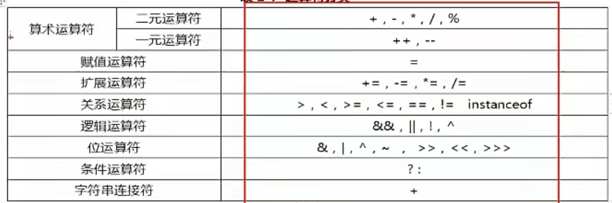
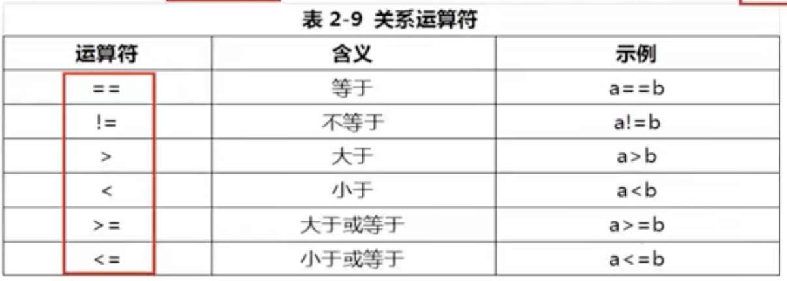
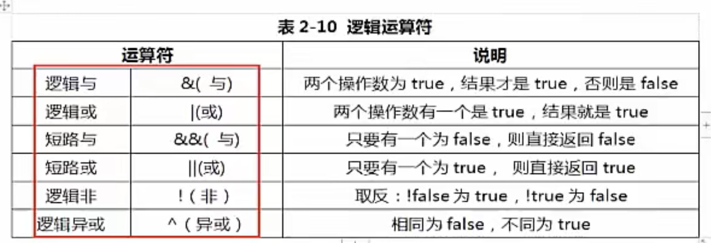
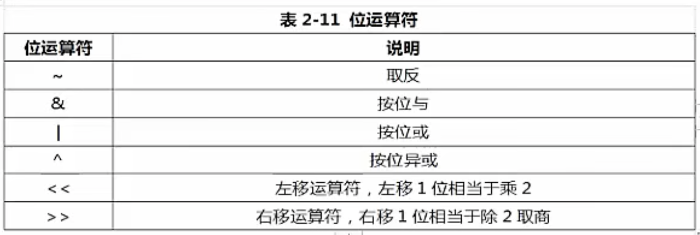
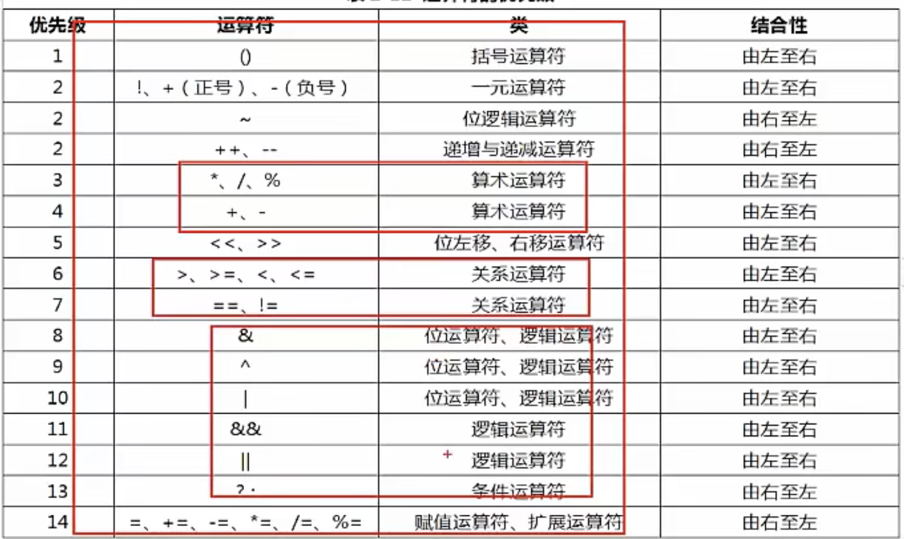
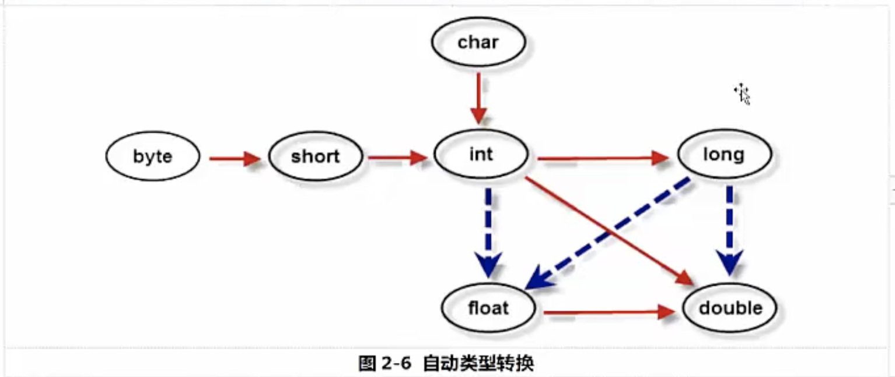

# 变量类型

- 本章主要介绍一些编程中的基本概念，比如:标识符号,变量,常量,运算符,基本数据类型的转换等等，这一些是编程中的砖块,是编程的基础,要想开始正式的编程,还要学会控制语句,控制语句,就像水泥,可以把砖块粘在一起,最终形成一座大厦

- 预备知识:

  1. 二进制:是计算机技术中广泛采用的一种数制,有德国数理哲学大师布莱尼次于1679年发明,二进制数据是用0和1两个数码来表示的,它的基数是2，逢二进一.数字计算机只可以识别0和1 组成的代码。其运算模式正是二进制。

  2. 二进制广泛对应两种状态,广泛应用于电子科学.比如:可以对应电子器件的开关状态,对应信号电压状态,对应是否打孔状态,电磁存储状态等等

- 注释:

  - 为了方便程序的阅读,Java语言允许程序员在程序中写上一些说明文字,用来提高程序的可读性,这一些文字的说明被称为注释.

  - 注释不会出现在字节码文件中,即Java编译器编译时会跳过注释语句.

  - 在Java中根据注释的功能不同,主要分为单行注释,多行注释和文档注释

    - 单行注释:

      - ```java
        单行注释使用 // 来表示 //后面的内容均为注释
        ```

    - 多行注释:

      - ```java
        多行注释使用 /*开头 */结尾,在/*和*/之间的被称为注释,我们也可以使用多行注释作为行内注释,但是在使用的时候需要注意不可以嵌套
          /*
          我是注释内容
          */
        ```

    - 文档注释:

      - ```java
        文档注释是按照/**开头 /结尾,注释中包含一些说明性的文字以及一些JavaDoc文档标签
        可以用来生成项目的API文档
        ```

  - 标识符:

    - 标识符用来给变量,类,方法以及包进行命名的,比如Welcome,标识符需要遵循一定的规则.
    - 标识符:必须是字母,下划线,美元符号$开头。
    - 标识符其他的部分可以是字母,下划线_,美元符号$ 和数字的任意组合
    - Java的标识符大小写敏感,且长度无限制
    - 标识符号不可以使用Java的关键字

- 变量:

  - 概念:变量的本质上就是一个可操作的存储空间, 空间的位置是确定,但是它里面放置啦什么值是不确定的，我们可以通过变量名称来访问对应的存储空间，从而操纵这个存储空间的值。
  - Java 是一种强类型语言,每个变量都必须声明其数据类型。变量的数据类型决定了变量占据存储空间的大小,比如int a =23 表示a变量的空间为4个字节
  - 变量作为程序中最基本的存储单元,其要素包含变量名,变量类型,和作用域.变量在使用前必须对其声明.只有在变量被声明以后,才能为其分配相应长度的存储空间。

- 变量的声明:

  - 格式:type varName = value; 数据类型 变量名称 = 值

  - eg:

  - ```java
    public class variable_Demo {
    
        public static void main(String[] args) {
            //变量的声明
            //八种基本变量类型
            double salary;
            int age;
            long earthConunt;
            float fl;
            byte b1;
            short s1;
            boolean bool1;
            char ch1;
    
        }
    }
    ```

- 变量的声明和初始化:

- ```java
  public class variable_Demo01 {
  
      public static void main(String[] args) {
          //变量的声明和初始化
          int a =3;
          long l1 =12L;
          float f1=3.5f;
          byte b1 =12;
          short s1=12;
          char cch ='A';
          boolean bool1 = true;
          double d1 = 12.6d;
          System.out.println(a);
          System.out.println(l1);
          System.out.println(f1);
          System.out.println(b1);
          System.out.println(s1);
          System.out.println(cch);
          System.out.println(bool1);
          System.out.println(d1);
  
      }
  }
  ```

- 变量的分类和作用域:

  - 从整体上可将变量分为局部变量,成员变量(成员实例) 和静态变量(类变量)

  - | 类型               | 声明位置           | 从属于      | 声明周期                                                     |
    | ------------------ | ------------------ | ----------- | ------------------------------------------------------------ |
    | 局部变量           | 方法或者语句块内部 | 方法/语句块 | 从声明位置开始,直到方法或者语句块执行完毕,局部变量消失       |
    | 成员变量(实例变量) | 类内部,方法外部    | 对象        | 对象创建,成员变量也跟着创建<br />对象消失,成员变量也跟着消失 |
    | 静态变量(类变量)   | 类内部,static修饰  | 类          | 类被加载,静态变量就有效,类被写卸载静态变量消失               |

  - 局部变量(local varable):方法或者语句块内定义的变量,生命周期是从声明的位置开始到方法或者语句执行完毕为止,局部变量在使用前必须先声明,初始化,在使用

  - 成员变量(实例变量 member variable):方法外部,类的内部定义的变量,从属于对象,生命周期伴随着对象始终,如果不自行初始化，它会自动初始化成该类型的默认初始值。

    - int 类型初始值为0 
    - double 类型初始值为0.0
    - char 类型初始值 ‘\u0000’
    - boolean 类型初始值:false

  - 静态变量(类变量 static variable):使用static定义,从属于类,生命周期伴随类始终,从类的加载到类的卸载,如果不自行初始化的话,与成员变量相同的类型会初始化为该类型的默认初始化的值

  - 代码实例:

  - ```java
    public class variable_Local_Demo {
        String stuName;//成员变量 从属于对象
        static String stuClass; //静态变量 从属于类
    
    
        public static void main(String[] args) {
            //局部变量
            int age =20;
            double salary = 300;
        }
    }
    ```

- 常量:Constant

  - 常量通常指的是一个固定的值,例如 1,2 ,3.14等等

  - 在Java语言中,主要是利用关键字final来定义一个常量,常量一旦被定义初始化后不能更改其值。

  - 声明格式: final type varName =value;

  - 代码实例:

  - ```java
    public class contants_Demo {
        public static void main(String[] args) {
            //常量使用fianl 修饰
            //常量的变量名称一般是大写
            final double PI=3.14;
            System.out.println(PI);
            final String NAME ="张三";
            System.out.println(NAME);
        }
    }
    
    ```

- 基本数据类型:

  - Java是一种强类型语言,每个变量都必须声明类型,Java的数据类型可分为:基本数据类型和引用数据类型.
  - 基本数据类型:
    - 数值型:byte short int long double float
    - 字符型: char
    - 布尔类型:bool
  - 引用数据类型: 类 接口 数组 引用数据类型固定为4个字节
  
- 整型:整型用于表示没有小数部分的数值,它允许是负数,整型的范围与运行Java代码的机器无关,这正是Java程序具有很强移植性的原因之一,

  - | 类型  | 占用存储空间  | 表示范围                |
    | ----- | ------------- | ----------------------- |
    | byte  | 1个字节(8位)  | -2的7次方～2的7次方-1   |
    | short | 2个字节(16位) | -2的15次方～2的15次方-1 |
    | int   | 4个字节(32位) | -2的31次方～2的31次方-1 |
    | long  | 8个字节(64位) | -2的63次方～2的63次发-1 |

  - 表示形式:

    - 二进制:要求是0b开头 只有0和1组成
    - 八进制:要求0开头 从0到7
    - 十进制:从0到9
    - 十六进制:要求0x开头,有0和9组成,a到f组成

  - Java语言的整型默认是位int类型,声明long类型的时候需要在变量后面加上L/l

  - 代码实例:

  - ```java
    public class basic_data_Demo {
    
        public static void main(String[] args) {
            //基本数据类型
            byte  b1 =127;
            short s1 = 129;
            int i1 = 20000;
    
            int a =015;//表示八进制
            int b = 0x15;//表示十六进制
    //        int c =0b01; Java中不显式支持二进制
    
            //在声明类型的时候需要在值后面加上一个L或者l;
            long l1 = 89L;
            long l2 = 89l;
            //声明一个char字符类型
            char c1 = 'S';
            //声明一个布尔类型
            boolean b2 = true;
    
        }
    }
    ```

- 浮点型:带有小数的数据在Java中被称为浮点型,浮点型可分为float类型和double类型

  - | 类型   | 占用空间      | 表示范围 |
    | ------ | ------------- | -------- |
    | float  | 4个字节(32位) |          |
    | double | 8个字节(64位) |          |

    float类型又被称为单精度类型,尾数可以精确到7位有效数字,在很多的情况下float精度很难满足要求,而double表示这种类型的精度式float的两倍,又被称为双精度类型,绝大部分应用程序都是采用double类型

  - 代码实例:

  - ```java
    //使用科学计算法表示浮点型
            double dd = 314e2; //表示3.14*10的2次方
            System.out.println(dd);
            //在定义float类型的时候需要在数值后面加上f,表示float类型
            float ff=  1.65f;
            System.out.println(ff);
            //浮点型不精确 一般不直接比较大小
            float f1 = 122388883L;
            float f2= f1+1;
            System.out.println(f1==f2); //结果是true
    ```

- 字符型:字符型占用2个字节,在Java中使用单引号表示字符,例如‘A’ 是一个字符,"A"是一个字符串

  - char类型,用来表示unicode编码中的字符,Unicode编码被设计用来处理各种语言文字,她占有2个字节,可允许65536个字符.

  - 代码实例:

  - ```java
    char c1 ='a';// 表示一个字符
    char c2 ='b'; //表示一个字符
    char c3 ='张';
    
    char c4='\u0078';//使用Unicode编码表示字符
    char c5='\u0009';//表示制表符
    System.out.println(c5);
    char c6='\"';//表示双引号
    System.out.println(c6);
    ```

  - 在Java中还允许使用转义字符,来将其后的字符转变为其他含义,常用的转义字符及其含义,

  - | 转义符 | 含义        | Unicode编码 |
    | ------ | ----------- | ----------- |
    | \b     | 退格        | \u0008      |
    | \n     | 换行        | \u000a      |
    | \r     | 回车        | \u000d      |
    | \t     | 制表符(tab) | \u0009      |
    | \ "    | 双引号      | \u0022      |
    | \ '    | 单引号      | \u0027      |
    | \ \    | 反斜杠      | \u005c      |

- boolean类型:

  - 概念:boolean类型有两个常量值,true和false,在内存中占有一个字节或者4个字节,不可以使用0或者非0的整数代替 true或者false.

  - 用来判断逻辑,一般用在程序流程控制。

  - 代码实例:

    ```java
    boolean flag = true;//表示成立
    boolean flag1 = false;//表示不成立
    ```

- 运算符:计算机的最基本用途之一,作为一门计算机语言,Java也提供了一套丰富的运算符来操作变量.

  - 
  
  - 算数运算符:算术运算符中的+-*/ % 属于二元运算符,二元运算符是需要两个数同时操作才能完成的运算符,其中%是取模运算符,就是我们常说的求余数的操作.
    - 整数运算:
      - 如果两个操作数有一个为long类型的话,则结果也是long类型。
      - 没有long类型的话，结果为int,即使是byte,short 结果也是int，
    - 浮点运算:
      - 如果两个操作数有一个是double的话,则结果全是doule
      - 只要两个操作数都是float的,则结果才是float
    - 取模运算:
      - 其操作数可以为浮点数,一般使用整数,结果是余数, 余数符号和左边操作数相同,例如:7%3=1 ----->>>>-7%3=-1     ----->7%-3=1
      - 
    
    - 算术运算符中++自增,--(自减)属于一元运算符,该运算符只需要一个操作符
    
      - 代码实例:
    
      - ```java
        int a =3;
                int b = a++;//执行完之后,b等于3 先把a的值赋值给b,a的值自增 b的值没有发生变化，只是a的值发生了变化
                System.out.println(b);
                int c =3;
                int d = ++c;//执行完之后,d等于3 先把c的值增加1 c的值为4 在赋值给d
                System.out.println(d);
        ```
    
  - 赋值及其扩展运算符:
  
    - 
    - 代码示例:
    - ```java
      int a1 =3;
              int b1 =4;
              a1+=b1;//相当于a1= a1+b1;
              System.out.println(a1);
              System.out.println(b1);
      
              int a2 = 3;
              int b2 =4;
              a2-=b2;//相当于a2 = a2-b2;
              System.out.println(a2);
      
               int a3 = 3;
               int b3 = 4;
               a3*=b3;//相当于a3 = a3*b3;
              System.out.println(a3);
      
              int a4 = 8;
              int b4 = 4;
              a4/=b4;//相当于 a4 =a4/b4
              System.out.println(a4);
      ```
  
  - 关系运算符:关系运算符用来进行比较运算符,关系运算符的结果是布尔类型: true/false
  
    - 
  
    - 注意:
  
      - =是赋值运算符,而真正的判断两个操作数是否相等的运算符是==;
      - == 和!= 是所有(基本和引用类型)都可以使用
      - “>” ">=" "<" "<="仅针对数值类型(byte short int long float double char)
  
    - 代码示例:
  
    - ```Java
      int a =3;
              int b =4;
              boolean f1 = a>b;
              System.out.println(f1);
              boolean f2 = a<b;
              System.out.println(f2);
      //char的范围是0～65535之间,所有的字符都可以在char类型中对应这一个数字,
              // 可以使用(int)变量名强制转换为int类型查看
              char c = 'a';
              System.out.println((int)c);
              char c1 = '~';
              System.out.println((int)c1);
      ```
  
  - 逻辑运算符:
  
    - Java中逻辑运算符,逻辑运算符的操作数和运算结果都是boolean类型
  
    - 
  
    - 短路与和短路或采用短路的方式,从左到右计算,如果通过运算符左边的操作数就可以确定该逻辑表达式的值,则不会计算运算符右边的操作数,提高效率。
  
    - 代码示例:
  
    - ```Java
      //测试逻辑运算符
              boolean b1= false;
              boolean b2= true;
              System.out.println(b1&b2);//与:有一个为false 结果是false
              System.out.println(b1|b2);//或:有一个为true 结果是true
              System.out.println(!b1);//非: 取反 !
              System.out.println(b1^b2);//异或: 相同为false 不同为true
      
              //短路计算规则:从左到右计算,如果通过运算符左边的操作数就可以确定该逻辑表达式的值,
              // 则不会计算运算符右边的操作数,提高效率
              //短路与
              //0不能当除数,当遇到0是除数的时候程序会报错 但是&&是短路计算
              boolean b3 = 1>2 &&(4<3/0);
              System.out.println(b3);
              //短路或
              boolean b4 = 1<2 ||(4<3/0);
              System.out.println(b4);
      ```
  
- 位运算符:

  - 位运算指的是进行二进制位的运算

  - 

  - 代码示例:

  - ```Java
    int a =7;//0111
            int b =8;//1000
            System.out.println(a&b);//结果:0
            System.out.println(a|b);//结果:15
            System.out.println(a^b);//结果:15
            System.out.println(-b);//结果:-9
    
    
            //移位:
            // <<n 相当于n个2相乘在乘原来的数
            int c =5;
            System.out.println(c<<3);//:5*2*2*2
            // >>n 相当于原来的数除以n的2相乘的结果
            System.out.println(40>>3); //:40/2*2*2
    ```

- 字符串链接符:

  - +表示字符串链接符,运算符两侧只要有一个是字符串(String)类型,系统就会自动将另外一个连接数转换成字符串进行连接。

  - 代码示例:

  - ```Java
    int age =25;
            String name="张三";
            String sc="24";
            System.out.println(name+age);
            System.out.println(age+sc);//并不是29，而是字符串组成的2524
    ```

- 条件运算符:

  - 语法格式:x?y:z 

  - 其中x位boolean类型表达式,先计算x的值,若x位true,则整个运算的结果为表达式y的值，否则为表达式z的值.

  - 代码示例:

  - ```Java
    int num1 =90;
            int num2 =100;
    //	计算两个数中的最大值
            int max = num1>num2?num1:num2;
            System.out.println(max);
    
    
            //计算三个数中的最大值
            int num3 = 89;
            int max1 = (num1>num2?num1:num2)>num3?(num1>num2?num1:num2):num3;
            System.out.println(max1);
    ```

- 运算符的优先级:

  - 
  - 注意:遇到复杂的表达式使用小括号来提升优先级.

- 自动类型转换:

  - 自动类型转换指的是容量小的数据类型可以转换为容量大的数据类型,.如下图,黑色表示无数据丢失的自动类型转换,而虚线表示在转换的时候可能存在会有精度的损失。

  - 

  - 代码示例:

  - ```Java
    int a  =1234;
            long b = a; //可以从int类型转换为long类型(可以从容量小的类型转为容量大的类型)
    //        int c =b; 错误类型 不可以从容量大的转换为容量下的类型
            double d= a; //可以转换
            float e =a; // 可以转换
            //特例:整数常量是int类型,可以自动转换为byte short char 只要不超过对应类型的表示范围即可
            byte b1 = 123;
    //        byte b2= 1234; byte类型的范围是-128到127
            char h =97; //会自动把97转换为char对应的符号
            System.out.println(h);
    ```

- 强制类型转换:

  - 强制类型转换,又被称为造型(cast),用于强制的转换一个数值的类型,在有可能丢失信息的情况下进行的转换是通过造型来完成的，但可能造成精度降低或者溢出

  - 语法格式:(type)var

  - 运算符()中的type类型表示将var的值想要转换成目标数据类型。

  - 注意:当将一种类型强制转换为另外一种类型,而有超过了目标类型的表数范围,就会被截断成一个完全不同的值

  - 代码示例:

  - ```Java
    double d1 = 3.14;
            int a1 = (int)d1; //结果是3
            System.out.println(a1);
    
            //如果超过范围啦就会被截断成完全不想干的数值
            int a = 300;
            byte b =(byte)a;
            System.out.println(b);
            // 97 没有超过char的表示范围
            int a2 = 97;
            System.out.println((char)a2);	
    //表示年薪 10亿
            int salary=1000000000;
            //表示10年
            int year = 10;
            //结果不是100亿 因为100亿超过啦int的表示范围，因此会发生溢出的现象导致结果不准确
            System.out.println(year*salary);
            //解决方案: 将其中的一个因子(year)表示转换为long类型
            System.out.println((long)year*salary);
    ```

- 输入和输出:

  - Scnner类:获取用户在控制台的输入

  - 代码示例:

  - ```Java
    //Scanner 获取用户的输入
            //System.in 表示获取的是控制台的输入
            Scanner sc =new Scanner(System.in);
            System.out.println("请输入用户名称:");
            String uname = sc.nextLine();
            System.out.println("请输入你的年龄:");
            int age = sc.nextInt();
            System.out.println("请输入你的月薪:");
            double salary = sc.nextDouble();
    
            System.out.println("你的名称是:"+uname+",年龄是:"+age+",月薪是:"+salary);
    ```

    