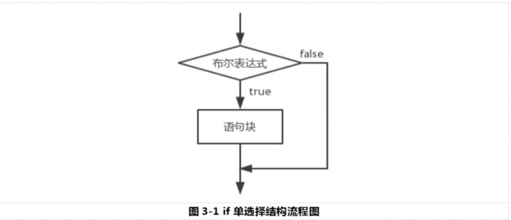
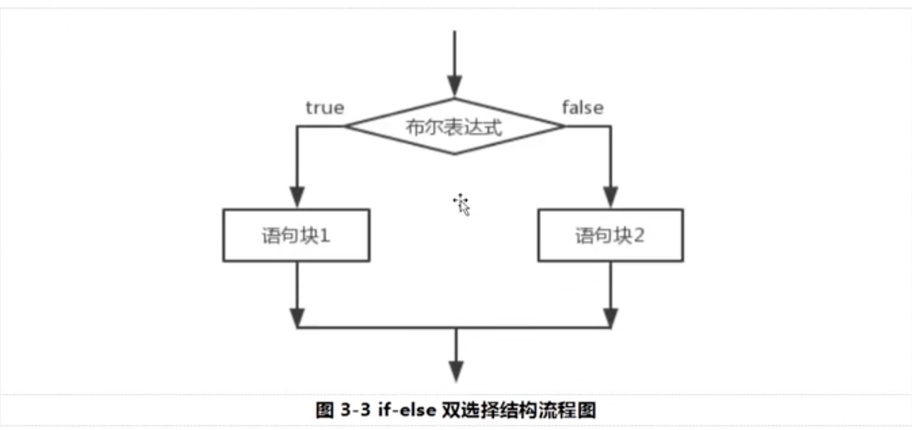

# 控制语句

- 顺序结构:

  - 表示从上到下依次执行,先执行a代码 在执行b代码

- 条件判断:

  - 表示:如果...则...

  - 单分支语法结构:

    - ```Java
      if(条件表达式){
      	语句块
      };
      ```

    - if语句对布尔表达式的值，进行一次判断,若判定为真的话，则执行{}中的语句块,否则跳过该语句块.

    - 

    - 代码示例:

    - ```Java
      double d = Math.random();//生成[0,1)之间的随即小数
              //生成[1,6]
              int i =1+(int)(Math.random()*6);
              int j=1+(int)(Math.random()*6);
              int k=1+(int)(Math.random()*6);
              int count = i+j+k;
              if(count>15){
                  System.out.println("手气很不错");
              }
              if(10<=count &&count<=15){
                  System.out.println("手气还可以");
              }
              if(count<10){
                  System.out.println("手气一般");
              }
              System.out.println(count);
      ```

  - if-else分支结构:

    - 语法结构:

    - ```Java
      if(布尔表达式){
      	语句块1
      }else{
      	语句块2
      }
      ```

    - 当布尔类型表达式为真的时候,执行语句块1，否则执行语句块2,也就是else部分。

    - 

    - 

- 循环结构:

  - 表示如果...则重复执行...