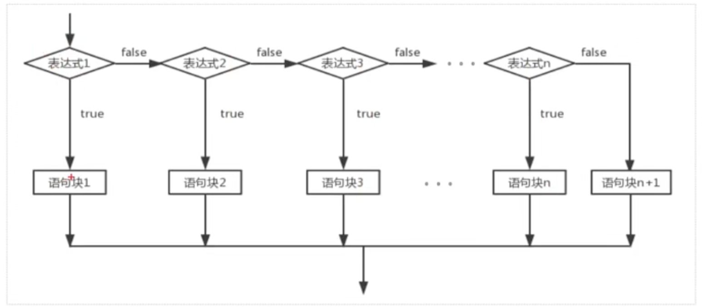
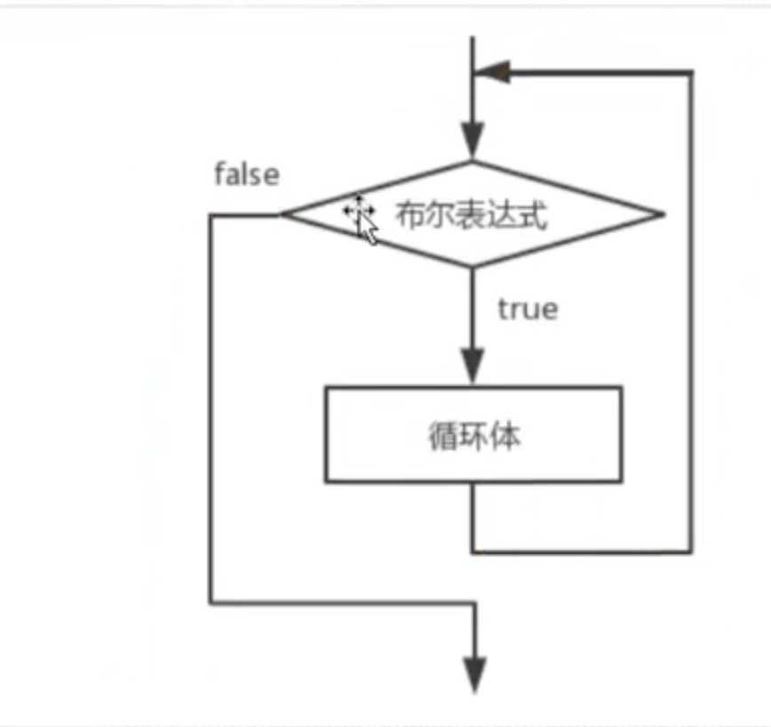
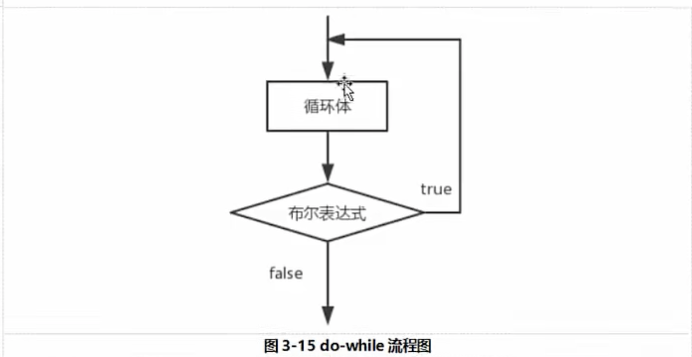
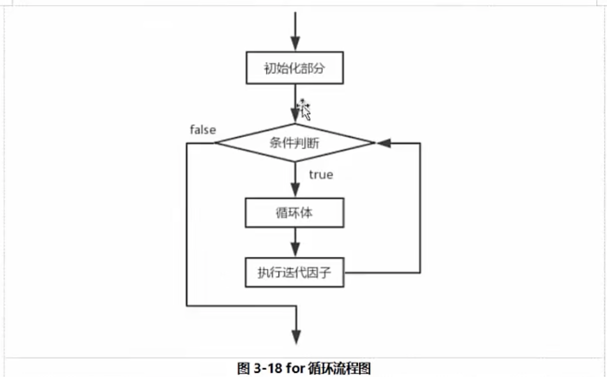

# 控制语句

- 顺序结构:

  - 表示从上到下依次执行,先执行a代码 在执行b代码

- 条件判断:

  - 表示:如果...则...

  - 单分支语法结构:

    - ```Java
      if(条件表达式){
      	语句块
      };
      ```

    - if语句对布尔表达式的值，进行一次判断,若判定为真的话，则执行{}中的语句块,否则跳过该语句块.

    - 

    - 代码示例:

    - ```Java
      double d = Math.random();//生成[0,1)之间的随即小数
              //生成[1,6]
              int i =1+(int)(Math.random()*6);
              int j=1+(int)(Math.random()*6);
              int k=1+(int)(Math.random()*6);
              int count = i+j+k;
              if(count>15){
                  System.out.println("手气很不错");
              }
              if(10<=count &&count<=15){
                  System.out.println("手气还可以");
              }
              if(count<10){
                  System.out.println("手气一般");
              }
              System.out.println(count);
      ```

  - if-else分支结构:

    - 语法结构:

    - ```Java
      if(布尔表达式){
      	语句块1
      }else{
      	语句块2
      }
      ```

    - 当布尔类型表达式为真的时候,执行语句块1，否则执行语句块2,也就是else部分。

    - 

    - 代码示例:
    
    - ```java
      double r = Math.random()*4;//生成[0,4)之间的随机数
              double area = Math.PI*r*r;//计算面积
              double circle = 2*Math.PI*r;//计算周长
              if(area>=circle){
                  System.out.println("面积是:"+area+",周长是:"+circle+",面积大于等于周长");
              }else {
                  System.out.println("面积是:"+area+",周长是:"+circle+",面积小于周长");
              }
      ```
    
  - if-else-if-else结构:

    - 语法结构:

    - ```java
      if(布尔表达式1){
        语句块1
      }else-if(布尔表达式2){
        语句块2
      }else-if(布尔表达式3){
        语句块3
      }else-if(布尔表达式n){
        语句块n
      }else{
        语句块n+1;
      }
      ```

    - 当布尔表达式1为真的时候,执行语句块1,否则判断布尔表达式2,当布尔表达式2为真的时候,执行语句块2,否则继续判断布尔表达式3,如果1～n个布尔表达式都为假的是,执行n+1语句块,也就是else部分。

    - 

    - 代码示例:

    - ```Java
      int age =(int)(100*Math.random());
              if (age<15){
                  System.out.println("儿童,喜欢玩!");
              }else if(age<25){
                  System.out.println("青年,要学习!");
              }else if(age<45){
                  System.out.println("中年,要工作!");
              }else if(age<65){
                  System.out.println("中老年,要补钙");
              }else if(age<85){
                  System.out.println("老年,多运动");
              }else {
                  System.out.println("老寿星,古来稀!");
              }
          }
      ```

- switch()语句:

  - 语法结构:
  
  - ```Java
    switch(表达式){
    	case 值1:
    			语句块1;
    			[break];//如果没有break的话,会把下面符合条件的全部执行 所以break一般不省略
    	case 值2:
    			语句块2:
    			[break];//可以省略
      case 值3:
      		语句块3;
      		[break];
      default:
      		默认语句块;
    }
    ```
  
  - switch语句会根据表达式的值从相匹配的case标签处开始执行,一直执行到break语句,或者switch语句的末尾,如果表达式的值与任意的case值都不匹配,则进入到default语句块。
  
  - 根据表达式的值不同,可以执行不同的操作,switch语句中case标签在JDK1.5之前必须是整数(long类型除外),或者枚举值,不能是字符串,但是在JDK1.7之后可以允许使用字符串,
  
  - 代码示例:
  
  - ```java
    //生成1～6之间随机数
            int num = (int)(Math.random()*5)+1;
            switch (num){
                case 1:
                    System.out.println("当前的数字是1");
                    break;
                case 2:
                    System.out.println("当前的数字是2");
                    break;
                case 3:
                    System.out.println("当前的数字是3");
                    break;
                case 4:
                    System.out.println("当前的数字是4");
                    break;
                case 5:
                    System.out.println("当前的数字是5");
                    break;
                case 6:
                    System.out.println("当前的数字是6");
                    break;
                default:
                    System.out.println("数字不合法");
                    break;
            }
    ```
  
- 循环结构:

  - 表示如果...则重复执行...

  - 循环结构分为两大类:一类是当型循环，一类是直到型循环

  - 当型:

    - 当布尔表达式条件为true的时候,反复执行某个语句,当布尔类型的表达式的值为false的时候,才会停止执行,比如while和for

  - 直到型:

    - 先执行某个语句,在判断布尔类型的表达式,如果为true的话,在执行某语句,如此反复,直到布尔类型表达式条件为false的时候,比如do-while循环。

  - whili循环:

    - 语法结构:

    - ```Java
      while(布尔表达式){
        循环体
      }
      ```

    - 在循环刚开始的时候，会计算一次布尔表达式的值,若条件为真的话,执行循环体,而对于后来的每一次循环,都会额外重新计算一次.

    - 语句中应有使循环语句趋向于结束的语句块,否则会出现无限循环--死循环

    - 

  - 代码示例:

  - ```Java
     public static void main(String[] args) {
            int sum=0;
            int i =0;
            while (i<101){
                sum+=i;
                i+=1;//i++
            }
            System.out.println(sum);
        }
    ```

- do-while循环:

  - 语法结构:

  - ```Java
    do{
      循环体
    }while(布尔表达式)
    ```

  - do-while循环会先执行循环体,然后在判断布尔表达式的值,若条件为真,执行循环体,当条件为假的的结束循环,do-while循环中循环体至少执行一次,

  - 

  - 代码示例:

  - ```java
    public static void main(String[] args) {
            int i=0;
            int sum =0;
            do {
                sum+=i;
                i+=1;
            }while (i<101);
            System.out.println(sum);
        }
    ```

- for循环:

  - 语法结构:

  - ```java
    for(初始表达式;布尔表达式;迭代因子){
      循环体;
    }
    ```

  - for循环语句是支持迭代的一种通用结构,是最有效的,最灵活的迭代方式,for循环在第一次反复之前要进行初始化，即执行初始表达式,随后,对布尔表达式进行判断,若判断结构为true,则执行循环体,否则终止循环,最后在每一次反复的时候,进行某种形式的步进,即执行迭代因子。

    - 初始化部分设置循环变量的初值
    - 条件判断部分为任意布尔表达式
    - 迭代因子控制循环变量的增减

  - for循环在执行条件判断之后,先执行循环体的部分，在执行步进。

  - 

  - 代码示例:

  - ```java
     //循环打印3次
            for(int i=0;i<3;i++){
                System.out.println("I Love U "+i);
            }
            //计算1到100的和
            int sum =0;
            for(int i =0;i<101;i++){
                sum+=i;
            }
    
            System.out.println("sum"+sum);
    ```

- 嵌套循环:

- break和continue: